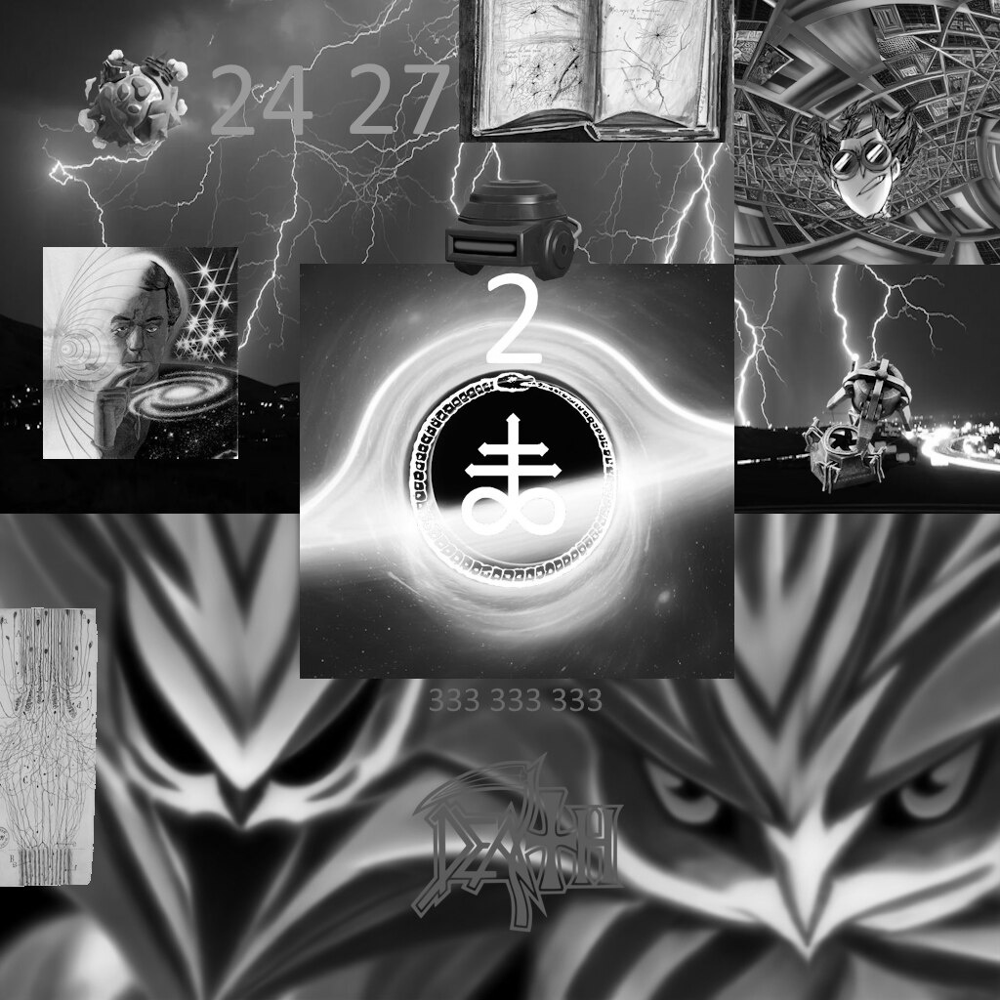
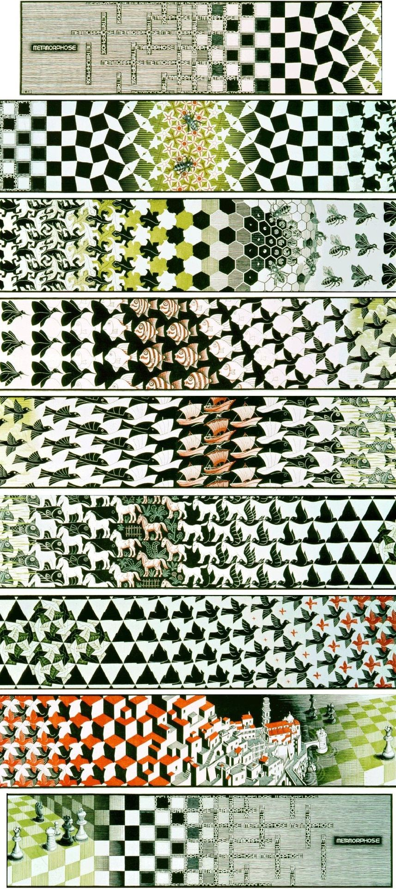

# Singularity Reading Club
Founded June 2025, affiliated with AIA@Illinois

A running list of books, papers, stories, and other media on superintelligence, self-improving systems, and the singularity.

**Contents:** [Seminars](#seminars) · [Nonfiction](#nonfiction) · [Fiction](#fiction) · [Papers](#papers) · [Essays, forecasts & online reading](#essays-forecasts--online-reading) · [Courses](#courses) · [Shows](#shows) · [Art](#art) · [Games](#games) · [Music](#music)

## Seminars

- Scalable oversight series (fall 2026):
  - [Discussion 1: history and concepts](./scalable%20oversight/history.md): self-reproduction, self-reference and scale, from von Neumann to fractals
  - [Discussion 2: comparing three proposals](./scalable%20oversight/discussion-2-topics.md): recursive reward modeling, AI safety via debate, and STEM AI / world models, with a [background primer](./scalable%20oversight/discussion-2-primer.md) that quotes the source papers
- [Theories of alignment](./theories%20of%20alignment/README.md): alignment methods compared on inner/outer alignment, scale invariance and competitiveness, with a summary of each paper and the [analysis criterion](./theories%20of%20alignment/criterion.md) behind it
- [Recursive summary of past discussions](./discussions/recursive-summary.md): a layered summary of what the club has talked about so far

---

## Nonfiction

| Title | Author |
| --- | --- |
| [Superintelligence: Paths, Dangers, Strategies](https://en.wikipedia.org/wiki/Superintelligence:_Paths,_Dangers,_Strategies) | [Nick Bostrom](https://nickbostrom.com/) |
| [Gödel, Escher, Bach: an Eternal Golden Braid](https://en.wikipedia.org/wiki/G%C3%B6del,_Escher,_Bach) | [Douglas Hofstadter](https://en.wikipedia.org/wiki/Douglas_Hofstadter) |
| Xenosystems | [Nick Land](https://en.wikipedia.org/wiki/Nick_Land) |
| Complexity: A Guided Tour | [Melanie Mitchell](https://en.wikipedia.org/wiki/Melanie_Mitchell) |
| [Gödel's Proof](https://en.wikipedia.org/wiki/G%C3%B6del%27s_Proof) | Ernest Nagel and James R. Newman |
| [The Infinity Machine: Demis Hassabis, DeepMind, and the Quest for Superintelligence](https://www.penguinrandomhouse.com/books/752231/the-infinity-machine-by-sebastian-mallaby/) | Sebastian Mallaby |
| [Theory of Self-Reproducing Automata](https://en.wikipedia.org/wiki/Von_Neumann_universal_constructor) | [John von Neumann](https://en.wikipedia.org/wiki/John_von_Neumann) |

## Fiction

| Title | Author |
| --- | --- |
| [The Last Question](https://en.wikipedia.org/wiki/The_Last_Question) (short story) | [Isaac Asimov](https://en.wikipedia.org/wiki/Isaac_Asimov) |
| [The Three-Body Problem](https://en.wikipedia.org/wiki/The_Three-Body_Problem_(novel)) | [Cixin Liu](https://en.wikipedia.org/wiki/Liu_Cixin) |
| [The Metamorphosis of Prime Intellect](https://en.wikipedia.org/wiki/The_Metamorphosis_of_Prime_Intellect) | Roger Williams |
| [Neuromancer](https://en.wikipedia.org/wiki/Neuromancer) (plus the [Sprawl trilogy](https://en.wikipedia.org/wiki/Sprawl_trilogy) and [Burning Chrome](https://en.wikipedia.org/wiki/Burning_Chrome)) | [William Gibson](https://en.wikipedia.org/wiki/William_Gibson) |
| [Accelerando](https://en.wikipedia.org/wiki/Accelerando) | [Charles Stross](https://en.wikipedia.org/wiki/Charles_Stross) |

## Papers

Scalable oversight and alignment proposals:

- [Scalable agent alignment via reward modeling](https://arxiv.org/abs/1811.07871) (Leike et al., 2018)
- [AI Safety via Debate](https://arxiv.org/abs/1805.00899) (Irving et al., 2018)
- [Supervising strong learners by amplifying weak experts](https://arxiv.org/abs/1810.08575) (Christiano et al., 2018)
- [An overview of 11 proposals for building safe advanced AI](https://arxiv.org/abs/2012.07532) (Hubinger, 2020)
- [Recursively Summarizing Books with Human Feedback](https://arxiv.org/abs/2109.10862) (Wu et al., 2021)
- [Measuring Progress on Scalable Oversight for Large Language Models](https://arxiv.org/abs/2211.03540) (Bowman et al., 2022)
- [Constitutional AI: Harmlessness from AI Feedback](https://arxiv.org/abs/2212.08073) (Bai et al., 2022)

## Essays, forecasts & online reading

- [Nick Bostrom's essays](https://nickbostrom.com/)
- [AI 2027](https://ai-2027.com/) forecast
- [AI 2040](https://ai-2040.com/) forecast
- [The Network State](https://thenetworkstate.com/) (online book) by Balaji Srinivasan
- [When AI builds itself](https://www.anthropic.com/institute/recursive-self-improvement) by Anthropic

## Courses

- [Iliad Intensive course materials](https://www.lesswrong.com/posts/dWQnLi7AoKo3paBXF/the-iliad-intensive-course-materials), especially the sections on:
  - Agent Foundations
  - AI Safety via Debate
  - Idealized Agency

## Shows

- [Black Mirror](https://en.wikipedia.org/wiki/Black_Mirror), specifically:
  - [S3E4: San Junipero](https://en.wikipedia.org/wiki/San_Junipero)
  - [S2E4: White Christmas](https://en.wikipedia.org/wiki/White_Christmas_(Black_Mirror))
  - [S3E3: Shut Up and Dance](https://en.wikipedia.org/wiki/Shut_Up_and_Dance_(Black_Mirror))
- [Pantheon](https://en.wikipedia.org/wiki/Pantheon_(TV_series)) (animated series about uploaded intelligence)

## Art

The full collection, with a linkable section per piece, is in the [art gallery](./images/README.md).

- [M. C. Escher](https://en.wikipedia.org/wiki/M._C._Escher) paintings and prints ([official gallery](https://mcescher.com/)), e.g. [Drawing Hands](https://en.wikipedia.org/wiki/Drawing_Hands), [Relativity](https://en.wikipedia.org/wiki/Relativity_(M._C._Escher)), [Ascending and Descending](https://en.wikipedia.org/wiki/Ascending_and_Descending), Metamorphosis III

## Games

- [Factorio](https://www.factorio.com/)
- [Civilization VI](https://en.wikipedia.org/wiki/Civilization_VI)
- [Minecraft](https://www.minecraft.net/)
- [Magic: The Gathering](https://magic.wizards.com/)

## Music

| Album | Artist |
| --- | --- |
| [Singularity](https://en.wikipedia.org/wiki/Singularity_(Jon_Hopkins_album)) | [Jon Hopkins](https://en.wikipedia.org/wiki/Jon_Hopkins) |
| [Hi This Is Flume](https://en.wikipedia.org/wiki/Hi_This_Is_Flume) | [Flume](https://en.wikipedia.org/wiki/Flume_(musician)) |
| [Lyfë](https://en.wikipedia.org/wiki/Lyf%C3%AB) | [Yeat](https://en.wikipedia.org/wiki/Yeat) |
| [Brat](https://en.wikipedia.org/wiki/Brat_(album)) | [Charli XCX](https://en.wikipedia.org/wiki/Charli_XCX) |
| 333 | [Bladee](https://en.wikipedia.org/wiki/Bladee) |
| [Random Access Memories](https://en.wikipedia.org/wiki/Random_Access_Memories) | [Daft Punk](https://en.wikipedia.org/wiki/Daft_Punk) |
| [OK Computer OKNOTOK 1997 2017](https://en.wikipedia.org/wiki/OK_Computer_OKNOTOK_1997_2017) | [Radiohead](https://en.wikipedia.org/wiki/Radiohead) |
