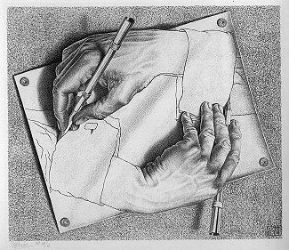
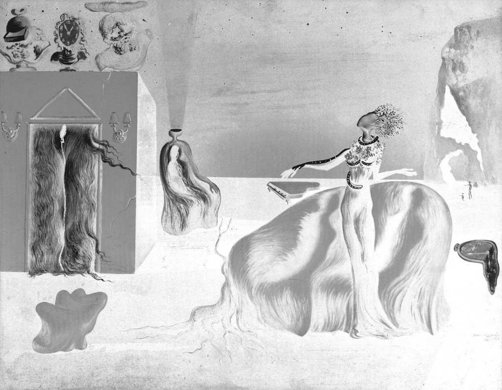
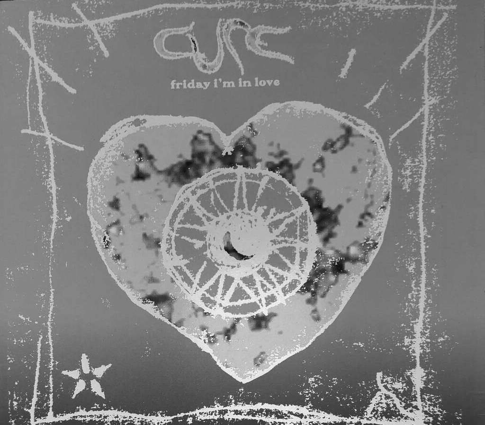

# Art

The Singularity Reading Club's art collection. Every piece in this folder has its own section below, so you can link straight to one (for example `images/README.md#drawing-hands`).

Back to the [reading list](../README.md#art).

## Contents

- [Singularity Reading Club collage](#singularity-reading-club-collage)
- [M. C. Escher](#m-c-escher)
  - [Drawing Hands](#drawing-hands)
  - [Metamorphosis II](#metamorphosis-ii)
- [Salvador Dalí](#salvador-dalí)
  - [Singularities](#singularities)
- [Album art](#album-art)
  - [333 (Bladee)](#333-bladee)
  - [Friday I'm in Love (The Cure)](#friday-im-in-love-the-cure)

## Singularity Reading Club collage

The club's own collage.

## M. C. Escher

[M. C. Escher](https://en.wikipedia.org/wiki/M._C._Escher) ([official gallery](https://mcescher.com/)). Also on the reading list: [Relativity](https://en.wikipedia.org/wiki/Relativity_(M._C._Escher)) and [Ascending and Descending](https://en.wikipedia.org/wiki/Ascending_and_Descending).

### Drawing Hands

[Drawing Hands](https://en.wikipedia.org/wiki/Drawing_Hands), 1948.

### Metamorphosis II

[Metamorphosis II](https://en.wikipedia.org/wiki/Metamorphosis_II), 1939–40.

## Salvador Dalí

[Salvador Dalí](https://en.wikipedia.org/wiki/Salvador_Dal%C3%AD).

### Singularities

*Singularities*, 1936.

## Album art

### 333 (Bladee)

Cover of *333* by [Bladee](https://en.wikipedia.org/wiki/Bladee), also in the reading list's [Music](../README.md#music) section.

### Friday I'm in Love (The Cure)

Cover of [Friday I'm in Love](https://en.wikipedia.org/wiki/Friday_I%27m_in_Love) by [The Cure](https://en.wikipedia.org/wiki/The_Cure).

