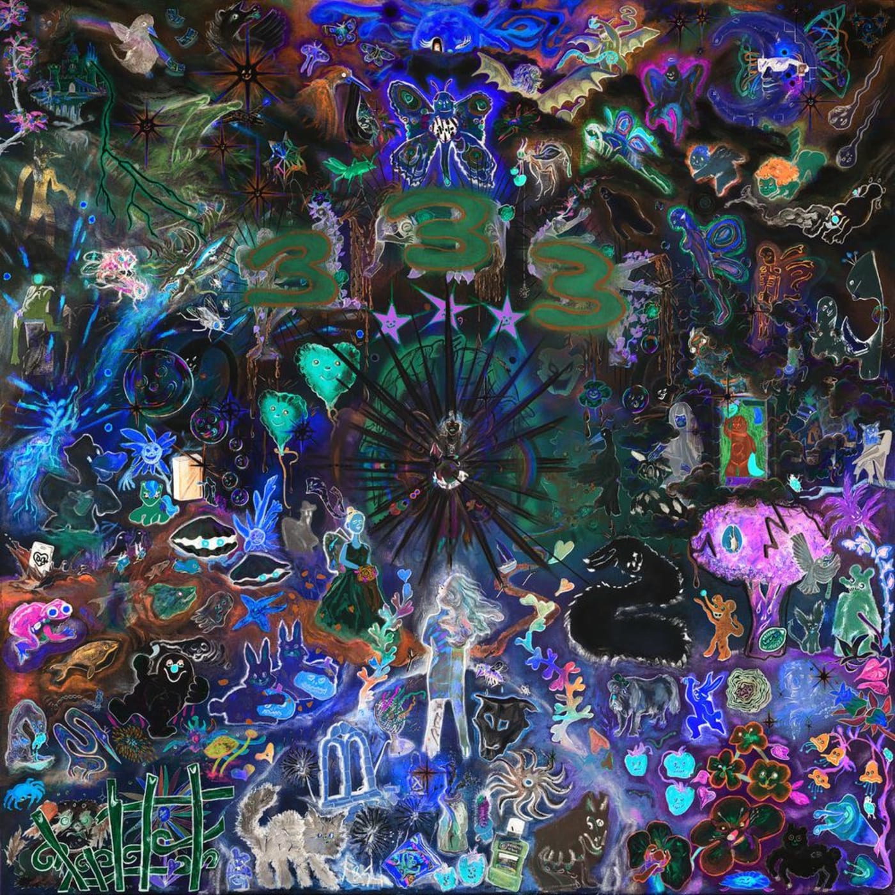

# Music

Part of the club's [media index](./README.md).

- [Singularity (Jon Hopkins)](#singularity-jon-hopkins)
- [Hi This Is Flume (Flume)](#hi-this-is-flume-flume)
- [Lyfë (Yeat)](#lyfë-yeat)
- [Brat (Charli XCX)](#brat-charli-xcx)
- [333 (Bladee)](#333-bladee)
- [Random Access Memories (Daft Punk)](#random-access-memories-daft-punk)
- [OK Computer OKNOTOK 1997 2017 (Radiohead)](#ok-computer-oknotok-1997-2017-radiohead)

## Singularity (Jon Hopkins)

[Singularity](https://en.wikipedia.org/wiki/Singularity_(Jon_Hopkins_album)) by [Jon Hopkins](https://en.wikipedia.org/wiki/Jon_Hopkins).

## Hi This Is Flume (Flume)

[Hi This Is Flume](https://en.wikipedia.org/wiki/Hi_This_Is_Flume) by [Flume](https://en.wikipedia.org/wiki/Flume_(musician)).

## Lyfë (Yeat)

[Lyfë](https://en.wikipedia.org/wiki/Lyf%C3%AB) by [Yeat](https://en.wikipedia.org/wiki/Yeat).

## Brat (Charli XCX)

[Brat](https://en.wikipedia.org/wiki/Brat_(album)) by [Charli XCX](https://en.wikipedia.org/wiki/Charli_XCX).

## 333 (Bladee)

*333* by [Bladee](https://en.wikipedia.org/wiki/Bladee).

## Random Access Memories (Daft Punk)

[Random Access Memories](https://en.wikipedia.org/wiki/Random_Access_Memories) by [Daft Punk](https://en.wikipedia.org/wiki/Daft_Punk).

## OK Computer OKNOTOK 1997 2017 (Radiohead)

[OK Computer OKNOTOK 1997 2017](https://en.wikipedia.org/wiki/OK_Computer_OKNOTOK_1997_2017) by [Radiohead](https://en.wikipedia.org/wiki/Radiohead).
